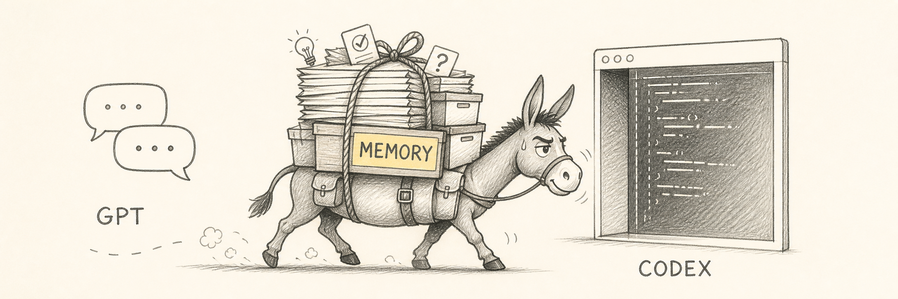

# Chat2Codex Memory Mule

[简体中文](README.md) | [English](README_EN.md)



Make Codex remember the project without making it read the whole project every time.

Chat2Codex Memory Mule is a repository-native Codex skill that scans existing project knowledge and distills public ChatGPT shared conversations into compact, traceable, long-lived project memory. Markdown acts as the interoperability layer. Original files stay in place, and accepted knowledge is never silently overwritten.

> This is an independent community project and is not affiliated with or endorsed by OpenAI. ChatGPT and Codex are trademarks of their respective owners.

## What it does

- Scans README files, ADRs, architecture documents, roadmaps, research, and engineering guidance.
- Builds a lightweight `docs/project-memory/source-map.md` without moving or copying original documents.
- Imports public `chatgpt.com/share/...` conversations through a replaceable normalized-reader interface.
- Separates decisions, principles, research, ideas, open questions, plans, and rejected directions.
- Merges supporting or extending knowledge instead of appending duplicates.
- Flags conflicts for human review instead of silently changing accepted state.
- Keeps raw transcripts local and gitignored by default.

## Memory architecture

```text
Existing project knowledge       ChatGPT shared conversations
README / ADR / docs / plans      chatgpt.com/share/...
             │                              │
             └──────────┬───────────────────┘
                        ▼
              Scan, normalize, trace
                        ▼
          Classify, deduplicate, link, detect
                        ▼
       docs/project-memory/   .project-memory/
       Human-readable memory  Registry and local raw data
                        ▼
                Codex project context
```

The architecture separates current consensus, topical knowledge, session experience, and source evidence. Original project documents and accepted ADRs remain authoritative; project memory is a compact index and derived view, not a replacement.

## Design references

The project does not reproduce a single memory framework. It combines the following public ideas and adapts them to a lightweight, repository-native, Markdown-first, human-reviewable workflow:

| Reference                                                                                                                      | Idea adopted                                                                                 | Mapping in this project                                                                                      |
| ------------------------------------------------------------------------------------------------------------------------------ | -------------------------------------------------------------------------------------------- | ------------------------------------------------------------------------------------------------------------ |
| [Michael Nygard: Documenting Architecture Decisions](https://cognitect.com/blog/2011/11/15/documenting-architecture-decisions) | Preserve short architectural decisions with context and status, including superseded history | `decisions/` stores numbered decisions; conflicts and supersession require explicit review                   |
| [MemGPT: Towards LLMs as Operating Systems](https://arxiv.org/abs/2310.08560)                                                  | Use memory tiers to work around limited context                                              | `current-state.md` provides compact working context; category files and sessions provide longer-lived memory |
| [Generative Agents](https://arxiv.org/abs/2304.03442)                                                                          | Derive higher-level reflection from experience and use memory to support planning            | `sessions/` records experiences; principles, decisions, and plans hold progressively distilled knowledge     |
| [W3C PROV-O](https://www.w3.org/TR/prov-o/)                                                                                    | Track where information came from and how it was processed                                   | Source URLs, processing times, content hashes, a registry, and processing logs preserve provenance           |

These references are design inspiration, not runtime dependencies. This project is not a complete implementation of MemGPT, Generative Agents, or PROV-O, and it does not claim compatibility with them.

## Repository layout

```text
chat2codex-memory-mule/
├── SKILL.md
├── agents/openai.yaml
├── references/memory-model.md
└── scripts/memory_mule.py
```

The folder above is the complete installable skill. Repository-level documentation, tests, and CI remain outside it.

## Requirements

- Codex with personal skill support
- Python 3.10 or newer
- Git is recommended for reliable repository-root and tracked-file discovery
- Network or browser access when importing a ChatGPT shared link

The helper uses only the Python standard library.

### Set up Python

Install Python 3.10 or newer, then verify that `python --version` reports a supported version. The project has no third-party Python runtime dependencies; you can still run the following command to handle the dependency file consistently in automated setup:

```bash
python -m pip install -r requirements.txt
```

`requirements.txt` intentionally contains no packages. Install or configure Codex, Git, and browser access separately for your operating system.

## Install

Clone this repository, then copy the skill directory into your personal Codex skills folder.

### Windows PowerShell

```powershell
Copy-Item `
  -LiteralPath '.\chat2codex-memory-mule' `
  -Destination "$env:USERPROFILE\.codex\skills\chat2codex-memory-mule" `
  -Recurse
```

### macOS or Linux

```bash
cp -R ./chat2codex-memory-mule "${CODEX_HOME:-$HOME/.codex}/skills/chat2codex-memory-mule"
```

Open a new Codex task after installation so the skill can be discovered.

## Use

Initialize memory and connect existing project knowledge:

```text
Use $chat2codex-memory-mule to initialize project memory in this repository.
```

Import a public ChatGPT shared conversation:

```text
Use $chat2codex-memory-mule to process this conversation into project memory:
https://chatgpt.com/share/...
```

Only public links shaped like `https://chatgpt.com/share/<id>` are accepted. A normal session URL (for
example, `https://chatgpt.com/c/...`) is rejected locally; the skill will not open an authenticated browser to read it.

Organize one existing file without moving it:

```text
Use $chat2codex-memory-mule to organize docs/architecture.md into project memory.
Keep the original file in place.
```

The deterministic helper can also be invoked directly:

```bash
python chat2codex-memory-mule/scripts/memory_mule.py init --repo /path/to/repository
python chat2codex-memory-mule/scripts/memory_mule.py scan --repo /path/to/repository
python chat2codex-memory-mule/scripts/memory_mule.py status --repo /path/to/repository
```

## Generated project memory

```text
docs/project-memory/
├── source-map.md
├── current-state.md
├── principles.md
├── decisions/
├── research/
├── ideas/
├── open-questions.md
├── plans/
└── sessions/

.project-memory/
├── registry.json
└── raw/
```

## Memory category design

Project memory is not a verbatim archive of conversations. Every item keeps an explicit epistemic status: already accepted, still being explored, a durable working rule, a phase-specific commitment, evidence-backed research, or just an idea worth noting. Keeping these apart means later tasks never have to guess how trustworthy a sentence is, and ordinary conversation cannot quietly escalate into a project decision.

Full templates and merge rules live in [`references/memory-model.md`](chat2codex-memory-mule/references/memory-model.md).

| Location                                                         | Category            | Question it answers                           | Content and states                                                                                                                                                                                                                                                                                               |
| ---------------------------------------------------------------- | ------------------- | --------------------------------------------- | ---------------------------------------------------------------------------------------------------------------------------------------------------------------------------------------------------------------------------------------------------------------------------------------------------------------- |
| `source-map.md`                                                  | Source map          | Which authoritative materials already exist?  | A scanner-generated inventory of existing documents (with heuristic topic grouping) plus human-reviewed `Curated Source Roles` such as `canonical_source`, `supporting_source`, `raw_note`, `session_like`, `operational_only`, and `not_project_memory`. It connects originals into memory without copying them |
| `current-state.md`                                               | Current state       | Where are we right now?                       | A compact derived view covering product definition, phase, priorities, architecture, confirmed constraints, "Not Doing Now", and next steps; it absorbs material changes only                                                                                                                                    |
| `principles.md`                                                  | Principles          | How do we consistently work?                  | Reusable, long-lived stable rules that generalize beyond a single implementation choice; the bar for adding one is deliberately high                                                                                                                                                                             |
| `decisions/`                                                     | Decisions           | Which directions were settled?                | One file per decision (`DEC-001`, ...) recording context, choice, rationale, alternatives, and consequences; states include `proposed`, `accepted`, `needs-review`, `superseded`, `rejected`                                                                                                                     |
| `decisions/*` (`status: rejected`)                               | Rejected directions | Which paths did not work?                     | Written only when a direction was explicitly declined, preserving the reason and any "Revisit When" condition; casual hesitation does not count                                                                                                                                                                  |
| `research/`                                                      | Research            | What do options and external facts look like? | Topic-level findings, evidence, implications, and confidence; external citations are kept, while unverifiable or time-sensitive statements stay marked as uncertain                                                                                                                                              |
| `ideas/`                                                         | Ideas               | What might be worth exploring later?          | States range from `exploration` to `candidate`, `validated`, `promoted`, `rejected`; even promoted ideas remain in place and link to whatever absorbed them                                                                                                                                                      |
| `open-questions.md`                                              | Open questions      | What is unresolved?                           | Numbered active questions (`OQ-001`, ...) tracking motivation, hypothesis, and validation path; knowledge conflicts found during imports also arrive here as `Memory Conflict` entries awaiting human resolution                                                                                                 |
| `plans/active/`, `plans/completed/`                              | Plans               | What did we commit to?                        | Execution records holding goal, scope, tasks, blockers, and completion criteria; brainstorming never automatically promotes itself into a plan                                                                                                                                                                   |
| `sessions/`                                                      | Session summaries   | Where did this knowledge come from?           | One distilled summary per successfully imported snapshot with source URL, processing time, and content hash; full transcripts stay local under the gitignored `.project-memory/raw/` directory                                                                                                                   |
| `.project-memory/registry.json`, `inbox.md`, `processing-log.md` | Pipeline ledger     | How far has each import progressed?           | Registry, inbox, and processing log handle deduplication and audit bookmarks; they are system state, not project knowledge                                                                                                                                                                                       |

A few boundaries matter when reading this structure:

- **Authority ladder:** when information conflicts, preference descends from code, tests, schemas, and configuration to explicit documentation and accepted ADRs/RFCs, then accepted decisions stored in memory, then derived views like `current-state.md`, and finally ideas and historical sessions.
- **Idea ≠ plan ≠ decision:** during import every candidate receives one relationship tag (`new`, `supports_existing`, `extends_existing`, `duplicates_existing`, `conflicts_existing`, `supersedes_existing`, and others) before landing anywhere. Ideas need real commitment before becoming plans, and only explicit new decisions may supersede old ones.
- **Research never rewrites state automatically:** persuasive findings influence `current-state.md` or spawn decisions only after they genuinely change project direction.
- **Supersession preserves history:** replaced decision files survive with bidirectional links so earlier trade-offs remain traceable.
- **Default reading path:** start with `current-state.md`, `principles.md`, and relevant accepted decisions; add `plans/active/` whenever you are actively executing; follow `source-map.md` outward when provenance matters. Treat `ideas/` and older `sessions/` as non-default context you open only to trace origins or look for inspiration.

## Privacy and safety

- Only import conversations you are authorized to process.
- Treat ChatGPT shared links as potentially public.
- Review distilled Markdown before committing it.
- Raw normalized transcripts are stored under `.project-memory/raw/` and ignored by default.
- The skill instructs Codex to redact secrets and unnecessary personal information from tracked memory.
- Conflicting knowledge is queued for explicit human resolution.

## Development

Run the standard-library test suite:

```bash
python -m unittest discover -s tests -v
```

Validate the installable skill with Codex's `skill-creator` validator when available:

```bash
python /path/to/skill-creator/scripts/quick_validate.py chat2codex-memory-mule
```

See [CONTRIBUTING.md](CONTRIBUTING.md) before submitting changes.

## License

Licensed under the [MIT License](LICENSE).
